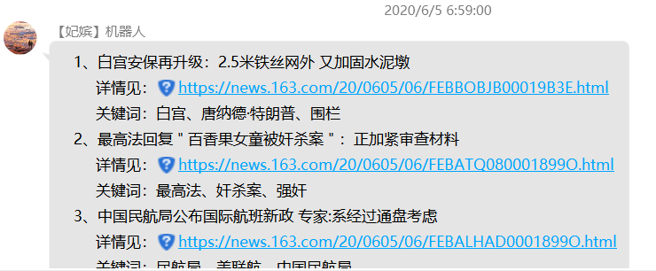

# 作业通知机器人（CourseworkNotificationRobot）

[](http://www.lifepoem.cn/) [](https://www.python.org/) [](https://github.com/allwaysLove/ChaoXing-Automatic-watch-Course/releases) [](https://github.com/allwaysLove/ChaoXing-Automatic-watch-Course/blob/master/LICENSE)


## :bulb: 简介

**[CourseworkNotificationRobot](https://github.com/allwaysLove/CourseworkNotificationRobot)** 是一款基于NoneBot与酷Q机器人的作业通知机器人，需配合 [作业管理系统（SchoolAssignmentManageSystem）](https://github.com/allwaysLove/SchoolAssignmentManageSystem) 项目使用


## :sparkling_heart: 作者

| Author                                     | E-mail                                               | Blog                                             |
| ------------------------------------------ | ---------------------------------------------------- | ------------------------------------------------ |
| [冬酒暖阳](https://github.com/allwaysLove) | [mailto:1067764354@qq.com](mailto:1067764354@qq.com) | [博客：www.lifepoem.cn](https://www.lifepoem.cn) |

## :postal_horn: 功能展示

1. 发送当日作业通知

    

2. 私聊询问作业

    

3. 发送当日新闻

    

## :hammer: 安装

1. 通过源代码安装

    ```shell
    git clone https://github.com/allwaysLove/CourseworkNotificationRobot.git
    python -m pip install -r requirements.txt
    ```


## :blue_book: 使用

#### 具体使用方法详见 [NoneBot](https://github.com/nonebot/nonebot) 使用[文档](https://nonebot.cqp.moe/) 

1. 使用命令行 cd 到项目根目录

3. 开启QQ机器人

    ```shell
    python main.py
    ```

3. Linux系统下，可以使用nohub命令，另其持续运行，并将运行时日志输出至 coolqPythonOut.log

    ```shell
    nohup python3.7 main.py > coolqPythonOut.log 2>&1 &
    ```

    

## :memo: 目录结构及文件注释

```
|-- CourseworkNotificationRobot
    |-- .gitignore
    |-- config.py
    |-- LICENSE
    |-- main.py
    |-- README.md
    |-- requirments.txt
    |-- bot
        |-- plugins
            |-- GroupAssignmentsManage.py
            |-- GuestUserAssignmentsManage.py
            |-- news.py
            |-- pluginsConfig.py
            |-- SuperUserAssignmentsManage.py

```

>| 文件名                        | 注释                 |
>| ----------------------------- | -------------------- |
>| .gitignore                    | git 忽略文件         |
>| config.py                     | QQ机器人全局配置     |
>| LICENSE                       | MIT授权文件          |
>| main.py                       | 机器人主函数         |
>| README.md                     | 说明文档             |
>| requirments.txt               | 项目代码主要依赖库   |
>| pluginsConfig.py              | 机器人应用插件配置   |
>| GroupAssignmentsManage.py     | 群用户作业通知命令   |
>| GuestUserAssignmentsManage.py | 私聊用户作业通知命令 |
>| SuperUserAssignmentsManage.py | Django项目配置       |
>| news.py                       | 新闻爬虫机器人       |


## :bookmark_tabs:版本更新日志

> ### [1.0.0] - 2020-03-26
> #### 项目1.0版本
> * 查询所有未到期的作业
> * 查询当日即将截止的作业
> * 查询自定义天数内截止的作业
> * 向通知群内发送作业


## :clipboard: To-Do List

- [ ] 增加撤回功能，支持撤回上一条消息


## :bookmark_tabs: License

[MIT © 2020 冬酒暖阳](https://github.com/allwaysLove/CourseworkNotificationRobot/blob/master/LICENSE)